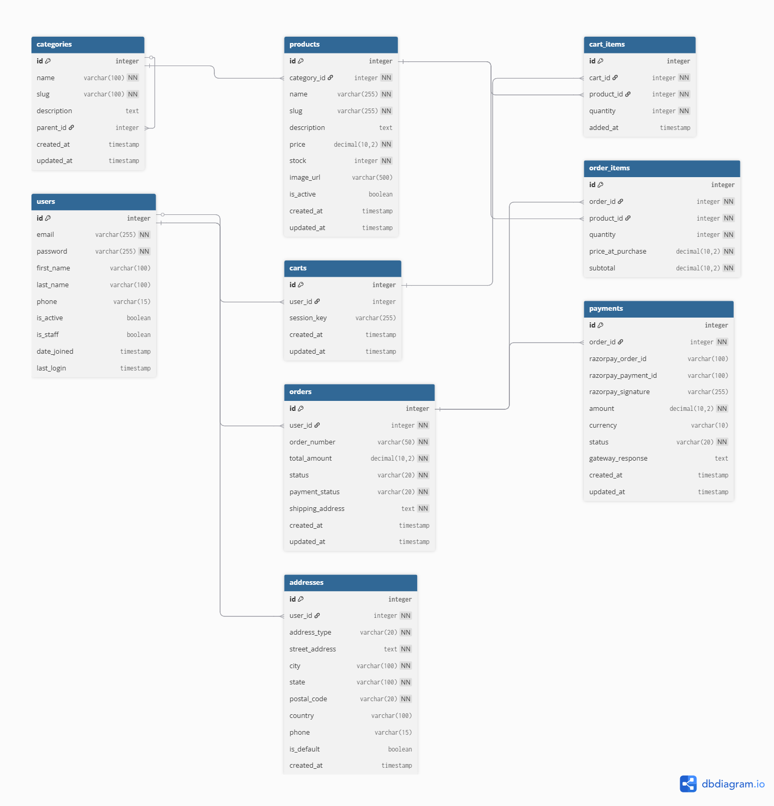

# E-Commerce Backend API

Production-ready RESTful e-commerce backend API built with Django REST Framework featuring complete order-to-payment flow, cart management, admin analytics, and comprehensive test coverage.

## 🚀 Features

- **User Authentication**: JWT-based authentication with token blacklisting
- **Product Management**: Full CRUD with categories, search, filtering, and pagination
- **Shopping Cart**: Session-based carts for anonymous users with automatic migration on login
- **Order Processing**: Atomic transactions with stock deduction and price snapshots
- **Payment Integration**: Razorpay gateway with signature verification and webhooks
- **Inventory Management**: Race condition prevention with row-level locking
- **Admin Analytics**: Revenue tracking, sales reports, and product insights
- **Testing**: 67% code coverage with 15 comprehensive tests

## 🛠️ Tech Stack

- **Backend**: Django 6.0, Django REST Framework
- **Database**: SQLite (Development) / PostgreSQL (Production-ready)
- **Authentication**: JWT (djangorestframework-simplejwt)
- **Payment**: Razorpay Python SDK
- **Testing**: pytest, pytest-django, pytest-cov
- **Security**: Environment variables, HMAC verification, CSRF protection

## 📊 Database Schema



### Models (9 Total)
- **User & Address**: Custom user model with shipping/billing addresses
- **Category & Product**: Nested categories with full product catalog
- **Cart & CartItem**: Session-based and user-based shopping carts
- **Order & OrderItem**: Orders with historical price snapshots
- **Payment**: Razorpay payment tracking with signature verification

## 🚦 API Endpoints (33 Total)

### Authentication (6 endpoints)
- `POST /api/auth/register/` - User registration with automatic cart migration
- `POST /api/auth/login/` - User login with cart merge
- `POST /api/auth/logout/` - Logout with token blacklisting
- `POST /api/auth/token/refresh/` - Refresh access token
- `GET /api/auth/profile/` - Get user profile
- `PATCH /api/auth/profile/` - Update user profile
- `POST /api/auth/change-password/` - Change password

### Categories (6 endpoints)
- `GET /api/categories/` - List root categories
- `GET /api/categories/all/` - List all categories (including nested)
- `GET /api/categories/{slug}/` - Category detail
- `POST /api/categories/` - Create category (admin only)
- `PUT /api/categories/{slug}/` - Update category (admin only)
- `DELETE /api/categories/{slug}/` - Delete category (admin only)

### Products (7 endpoints)
- `GET /api/products/` - List products with search, filters, pagination
- `GET /api/products/{id}/` - Product detail
- `POST /api/products/` - Create product (admin only)
- `PUT /api/products/{id}/` - Update product (admin only)
- `DELETE /api/products/{id}/` - Delete product (admin only)
- `GET /api/products/featured/` - Featured products (latest 10)
- `GET /api/products/low_stock/` - Low stock alert (admin only)
- `GET /api/products/analytics/` - Admin analytics dashboard (admin only)

**Query Parameters:**
- `search` - Search in name/description
- `category` - Filter by category slug
- `min_price` / `max_price` - Price range filter
- `in_stock` - Filter available items (true/false)
- `ordering` - Sort by price, created_at, name

### Cart (5 endpoints)
- `GET /api/cart/` - Get cart with totals
- `POST /api/cart/add/` - Add item with stock validation
- `PATCH /api/cart/items/{id}/` - Update quantity
- `DELETE /api/cart/items/{id}/` - Remove item
- `DELETE /api/cart/clear/` - Clear entire cart

### Orders (5 endpoints)
- `POST /api/orders/create_order/` - Create order (atomic transaction)
- `GET /api/orders/` - List user orders (paginated)
- `GET /api/orders/{id}/` - Order detail with items
- `POST /api/orders/{id}/cancel/` - Cancel and restore stock
- `PATCH /api/orders/{id}/update_status/` - Update status (admin only)

### Payments (3 endpoints)
- `POST /api/payments/initiate/` - Initiate Razorpay payment
- `POST /api/payments/verify/` - Verify payment signature
- `POST /api/payments/webhook/` - Razorpay webhook handler

### Admin Analytics (2 endpoints)
- `GET /api/products/analytics/` - Dashboard (revenue, top products, orders by status)
- `GET /api/orders/sales_report/?days=30` - Sales breakdown with date filtering

## 📦 Installation

### Prerequisites
- Python 3.10+
- Git

### Local Setup

1. **Clone repository**
```bash
git clone https://github.com/Saiful07/ecommerce-backend-api.git
cd ecommerce-backend-api
```

2. **Create virtual environment**
```bash
python -m venv .venv
# On Windows:
.venv\Scripts\activate
# On Mac/Linux:
source .venv/bin/activate
```

3. **Install dependencies**
```bash
pip install -r requirements.txt
```

4. **Environment variables**

Create `.env` file in project root:
```env
SECRET_KEY=your-django-secret-key
DEBUG=True
RAZORPAY_KEY_ID=rzp_test_YOUR_KEY_ID
RAZORPAY_KEY_SECRET=YOUR_KEY_SECRET
```

Get Razorpay test keys: https://dashboard.razorpay.com/app/keys (Test Mode)

5. **Database setup**
```bash
python manage.py migrate
python manage.py createsuperuser
```

6. **Run development server**
```bash
python manage.py runserver
```

Server: `http://127.0.0.1:8000`

## 🧪 Testing

**Run all tests:**
```bash
pytest
```

**With coverage report:**
```bash
pytest --cov=. --cov-report=term-missing
```

**Test specific module:**
```bash
pytest tests/test_auth.py
pytest tests/test_products.py
pytest tests/test_orders.py
```

**Current Coverage: 67%**
- 15 tests covering authentication, products, orders
- Critical flows: cart migration, order creation, stock management
- Payment mocking and race condition testing

## 🚀 Deployment

### Quick Deploy to Railway (Recommended)

1. **Install production dependencies:**
```bash
pip install gunicorn dj-database-url psycopg2-binary whitenoise
pip freeze > requirements.txt
```

2. **Create `Procfile` in project root:**
```
web: gunicorn ecommerce_backend.wsgi --log-file -
```

3. **Deploy:**
   - Go to https://railway.app
   - Sign up with GitHub
   - New Project → Deploy from GitHub repo
   - Select this repository
   - Add PostgreSQL database
   - Set environment variables: `SECRET_KEY`, `DEBUG=False`, `RAZORPAY_KEY_ID`, `RAZORPAY_KEY_SECRET`
   - Railway auto-deploys

4. **Run migrations:**
```bash
python manage.py migrate
python manage.py createsuperuser
```

**Alternative platforms:** Render, PythonAnywhere, Heroku

### Production Settings

Update `ALLOWED_HOSTS` in `settings.py`:
```python
ALLOWED_HOSTS = ['your-domain.com', 'your-app.up.railway.app']
```

**Security:** Always use environment variables for sensitive data in production.

## 🧪 Quick Test Flow (Postman)

### 1. Register User
```http
POST http://127.0.0.1:8000/api/auth/register/
Content-Type: application/json

{
  "username": "testuser",
  "email": "test@example.com",
  "password": "Test123!",
  "password2": "Test123!",
  "first_name": "Test",
  "last_name": "User",
  "phone": "1234567890"
}
```

### 2. Login & Get Token
```http
POST http://127.0.0.1:8000/api/auth/login/
Content-Type: application/json

{
  "username": "testuser",
  "password": "Test123!"
}
```

### 3. Create Product (Admin)
```http
POST http://127.0.0.1:8000/api/products/
Authorization: Bearer YOUR_ADMIN_TOKEN
Content-Type: application/json

{
  "name": "iPhone 15 Pro",
  "description": "Latest iPhone",
  "price": 129900.00,
  "stock": 50,
  "category": 1
}
```

### 4. Add to Cart
```http
POST http://127.0.0.1:8000/api/cart/add/
Authorization: Bearer YOUR_TOKEN
Content-Type: application/json

{
  "product_id": 1,
  "quantity": 2
}
```

### 5. Create Order
```http
POST http://127.0.0.1:8000/api/orders/create_order/
Authorization: Bearer YOUR_TOKEN
Content-Type: application/json

{
  "shipping_address": "123 Main St, City, State, 12345, Country"
}
```

### 6. Initiate Payment
```http
POST http://127.0.0.1:8000/api/payments/initiate/
Authorization: Bearer YOUR_TOKEN
Content-Type: application/json

{
  "order_id": 1
}
```

## 📝 Development Progress

**Project Completion: 100%** ✅

Detailed daily progress: [PROGRESS.md](PROGRESS.md)

### Completed Modules
- ✅ Authentication System (6 endpoints, 100% tested)
- ✅ Product Catalog (7 endpoints, 80% tested)
- ✅ Shopping Cart (5 endpoints, 100% tested)
- ✅ Order Management (5 endpoints, 80% tested)
- ✅ Payment Integration (3 endpoints, 65% tested)
- ✅ Admin Analytics (2 endpoints, 69% tested)
- ✅ Testing Suite (15 tests, 67% coverage)
- ✅ Deployment Ready

## 🏗️ Project Structure
```
ecommerce-backend-api/
├── accounts/              # Authentication & user profiles
├── products/             # Product catalog & categories
├── carts/                # Shopping cart management
├── orders/               # Order processing
├── payments/             # Razorpay payment integration
├── tests/                # Test suite (15 tests)
│   ├── test_auth.py
│   ├── test_products.py
│   └── test_orders.py
├── docs/                 # Documentation
│   └── database_schema.png
├── ecommerce_backend/    # Project settings
├── pytest.ini            # Test configuration
├── requirements.txt      # Dependencies
├── PROGRESS.md           # Daily development log
└── README.md
```

## 🔐 Security Features

- **JWT Authentication**: Secure token-based auth with 1-hour access tokens
- **Token Blacklisting**: Invalidates tokens on logout
- **Environment Variables**: Sensitive data in `.env` file
- **Password Hashing**: Django's PBKDF2 algorithm
- **CSRF Protection**: Built-in Django middleware
- **SQL Injection Prevention**: ORM parameterized queries
- **Input Validation**: DRF serializer validation
- **Permission Classes**: Role-based access (user/admin)
- **Atomic Transactions**: Data consistency for critical operations
- **Payment Signature Verification**: HMAC-SHA256 validation

## 🎯 Key Technical Features

### Atomic Transactions
- Order creation atomically deducts stock
- Cart migration merges items safely
- Order cancellation restores inventory

### Concurrency Handling
- `select_for_update()` prevents race conditions
- Row-level locking during order creation
- Prevents overselling during concurrent purchases

### Price Snapshot Pattern
- Stores product price at time of purchase
- Historical accuracy for orders
- Prevents price change issues in reports

### Session-Based Cart
- Anonymous users can shop without login
- Automatic migration to user account on login
- Handles duplicate items during merge

### Query Optimization
- `select_related()` for foreign keys
- `prefetch_related()` for reverse relations
- Strategic database indexes

## 📊 Project Statistics

- **Total Endpoints:** 33
- **Total Models:** 9
- **Total Tests:** 15
- **Test Coverage:** 67%
- **Total Commits:** 21
- **Development Time:** 10 days
- **Lines of Code:** ~1,100 (excluding migrations)

## 👤 Author

**Saiful Islam**  
Backend Developer specializing in Python/Django

- **GitHub:** [@Saiful07](https://github.com/Saiful07)
- **LinkedIn:** [saifulislam07](https://linkedin.com/in/saifulislam07)
- **Email:** mdsaifults08@gmail.com
- **Portfolio:** [saifuldz.netlify.app](https://saifuldz.netlify.app)

## 📄 License

This project is open source and available under the MIT License.

## 🙏 Acknowledgments

Built as a personal project to demonstrate production-grade backend development skills with Django REST Framework, focusing on e-commerce system architecture, payment integration, and test-driven development.

**Key Learning Outcomes:**
- Complex database design with 9 related models
- JWT authentication with token management
- Payment gateway integration (Razorpay)
- Atomic transactions and race condition prevention
- Test-driven development with pytest
- RESTful API design patterns
- Security best practices

## 📧 Contact

Open to backend developer opportunities and collaboration.

- **Email:** mdsaifults08@gmail.com
- **LinkedIn:** [saifulislam07](https://linkedin.com/in/saifulislam07)
- **Location:** Jamshedpur, Jharkhand, India